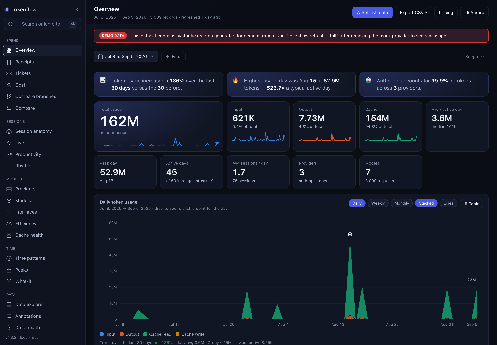
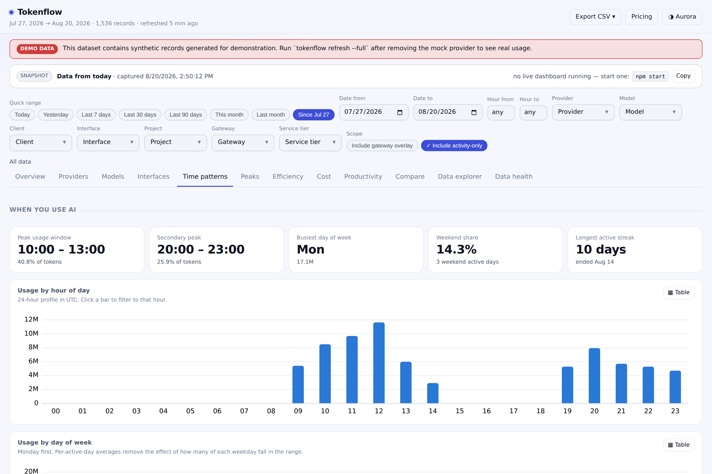
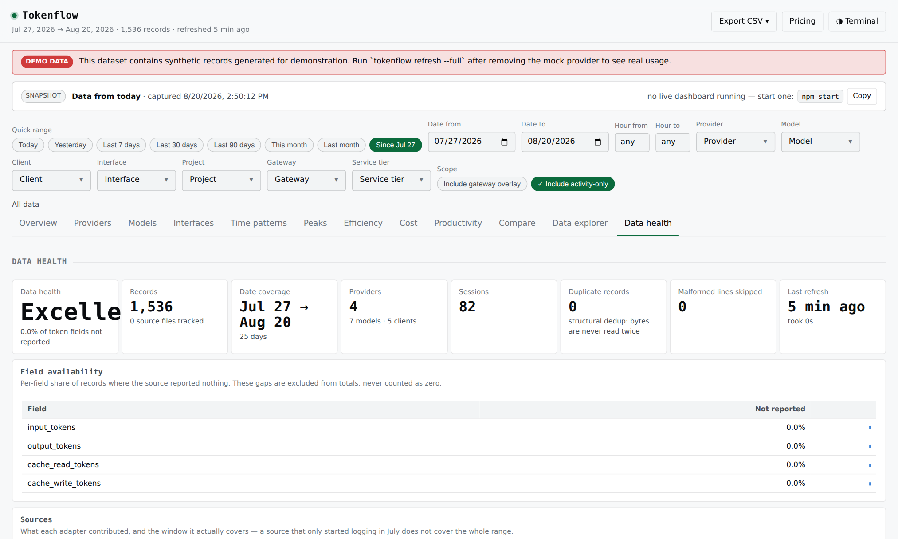
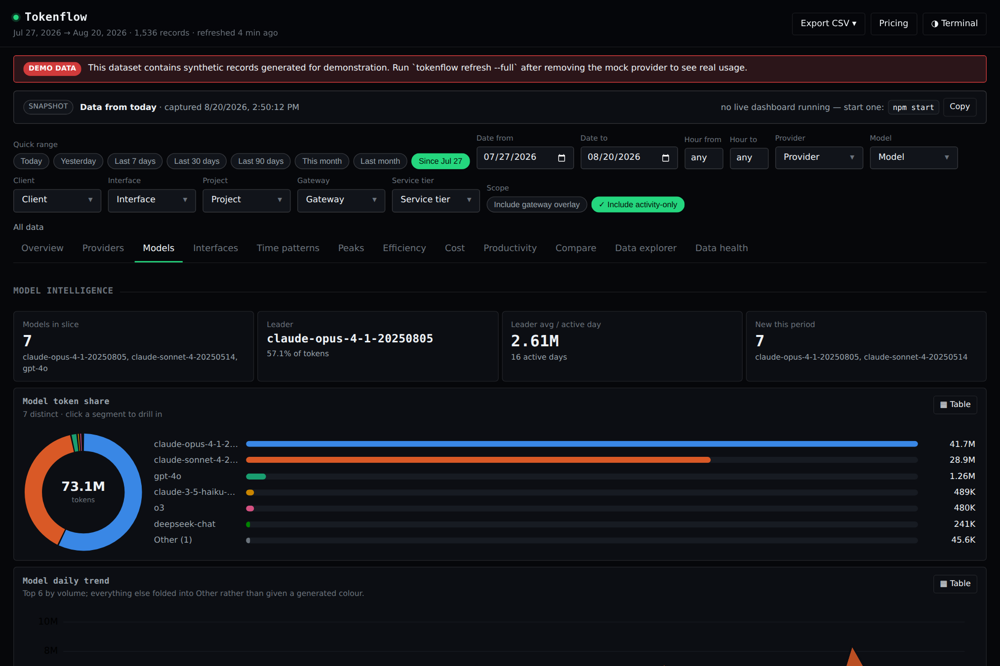
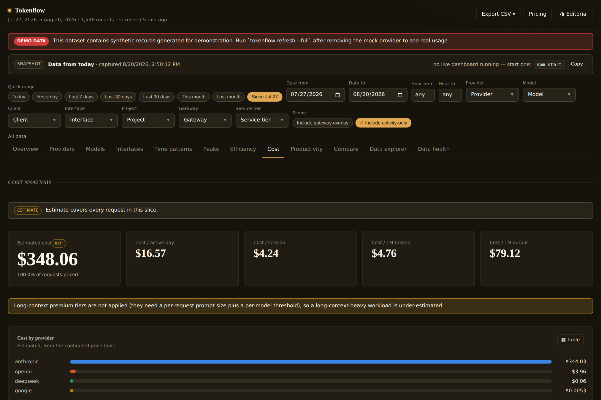

<h1 align="center">Tokenflow</h1>

<p align="center">
  <strong>See where your AI tokens actually go.</strong><br>
  Local-first, provider-agnostic analytics for the tokens you spend across Claude Code, Codex,
  Cline, Cursor, gateways — and anything else you can point it at.
</p>




Zero runtime dependencies. Nothing leaves your machine. No API keys, no accounts, no telemetry.

### Download & set up on your machine (macOS)

**1. Download** — grab `TokenFlow-*.dmg` from the
[**latest release**](https://github.com/vimoxshah/tokenflow/releases/latest)
(all releases: [github.com/vimoxshah/tokenflow/releases](https://github.com/vimoxshah/tokenflow/releases)).
Each release also carries `tokenflow-dashboard-demo.html`, a fully offline demo dashboard you can
open in any browser without installing anything.

**2. Install** — open the DMG and drag **TokenFlow.app** into Applications. Launch it from
Launchpad. The build is unsigned (no Apple Developer account behind this free project), so macOS
shows a security warning the first time. This is expected — TokenFlow is free, local-only, and
not notarized. Approve it once:

- **If you see "cannot be opened because Apple cannot check it":**
  1. Open **System Settings → Privacy & Security**, scroll to the **Security** section.
  2. Find the message *"TokenFlow was blocked…"* and click **Open Anyway**.
  3. Confirm **Open** in the popup (Touch ID / password if asked). Done forever — macOS won't
     ask again for this app.
- **Alternative:** right-click `TokenFlow.app` in Applications → **Open** → **Open**.

Nothing about this warning means the app is unsafe: it simply has no $99/yr Apple developer
signature. You can verify it phones home to nobody — see [Privacy & security](#privacy--security).

**3. Let it find your tools** — click the menu bar item and press **Run setup**, or run it in a
terminal:

```bash
npx tokenflow@latest setup     # detects Claude Code, Codex, OpenCode, Cursor, Cline…
```

Setup writes `~/.tokenflow/config.yaml` and reads nothing else. Then just keep the app running —
its watcher refreshes data every two minutes, and the popover shows today's cost, tokens,
per-provider usage, session blocks and capacity at a glance.

Prefer the terminal end-to-end? The same three commands work from a clone:

```bash
git clone https://github.com/vimoxshah/tokenflow.git && cd tokenflow
npm run setup        # detects the AI tools already on this machine
npm start            # ingest what's new, then open the dashboard
```

Three commands, no configuration, no keys. If nothing is detected that is a real answer, not a
failure — `tokenflow providers` tells you what it looked for and where.

There is no `npm install` step, because there is nothing to install. Node 22.5+ and nothing else.

**Platform.** macOS, Linux and Windows. Every push runs the test suite plus an end-to-end pass
— ingest, `status`, `validate`, CSV export, HTML export — on all three, against Node 22 and 24.
Log discovery is `os.homedir()`-relative (`~/.claude`, `~/.codex`, `~/.cline`, `~/.cursor`,
`~/.local/share/opencode`, `~/.hermes`), so it resolves the same way on each, and every source
path is overridable in config.

Two conveniences are bash-only: the `./tokenflow` wrapper and `Refresh & Open Dashboard.command`.
Anywhere without bash — Windows `cmd`/PowerShell included — use the `npm run` scripts or
`node bin/tokenflow.js <command>` directly. Same behaviour.

Just want to look around first?

```bash
npm run demo         # clearly-labelled synthetic data, then opens the dashboard
```

### Is this for you?

It is worth your time if you use AI coding tools daily and any of these questions is
uncomfortable to answer: *how much am I actually spending, where did the tokens go, which model
is doing the work, how much of my prompt is cache, and is the trend up?* Vendor consoles answer
that per vendor, per account, at their own granularity. This answers it across every tool on
your machine, at request granularity, with the raw records still on disk so you can check the
arithmetic.

It is **not** for you if you want team-wide chargeback out of the box (the data model is
multi-user-ready, the aggregation service is not built), or if your usage is entirely through a
hosted product that writes no local logs.

---

## 1. What it does

It answers the questions you can't answer from a billing page:

| Question | Where |
|---|---|
| How much AI did I use, and how has that changed? | Overview — KPIs, daily series, 7/30-day averages, trend |
| Input vs output vs cache? | Token composition — four mutually exclusive buckets that sum to the total |
| Which provider and model do I actually rely on? | Provider & Model intelligence — share, growth, per-model efficiency |
| CLI, IDE, desktop, or API? | Interfaces — classified only from an explicit surface field, never guessed |
| When do I use AI most? | Time patterns — hour profile, weekday profile, hour×weekday heatmap, calendar |
| What were my peaks? | Peaks — top days, peak week/month/hour/provider/model/interface |
| How efficiently am I using tokens? | Efficiency — output/input, cache hit rate, tokens per session/day/request |
| What does it cost? | Cost — estimated from a versioned price table, with coverage stated |
| Does my AI usage track my shipped work? | Productivity — correlations with git/IDE activity, labelled as correlations |
| What changed between two periods? | Compare — any two windows, metric by metric |
| Show me the actual records | Data explorer — searchable, sortable, paginated, exportable |
| Can I trust these numbers? | Data health — per-field availability, per-adapter coverage, drift checks |

<p align="center">
  
  
</p>

*Every screenshot on this page uses `npm run demo` data, which the UI labels as synthetic.*

## 2. Supported sources

| Adapter | Source | Reports | Kind |
|---|---|---|---|
| `anthropic` | `~/.claude*/projects/**/*.jsonl` | full per-request tokens: input, output, cache read, cache write (incl. long-TTL refresh), thinking | primary |
| `openai` | `~/.codex/sessions/**/*.jsonl` | per-turn tokens: fresh input, cached input, cache write, output, reasoning | primary |
| `opencode` | `$XDG_DATA_HOME/opencode/opencode.db` | per-request tokens: fresh input, cache read/write, output, reasoning | primary |
| `hermes` | `~/.hermes/state.db` | per-session-per-model tokens, measured cost when recorded | primary |
| `cline` | `~/.cline/data/sessions/**` | sessions, model, duration — **no token counts exist in this source** | activity |
| `cursor` | `~/.cursor/ai-tracking/ai-code-tracking.db` | AI-authored edits, per-commit AI/human line attribution | activity |
| `headroom` | `~/.headroom/savings_events.jsonl` | **measured** per-request cost + prompt-compression delta from a local gateway | overlay |
| `git` | any repository | commits, files changed, line churn — the independent work signal | activity |
| `generic` | CSV / TSV / JSON / JSONL / SQLite | anything, via a saved field mapping | primary |
| `mock` | — | deterministic demo data, always labelled | primary |

The provider list is not hardcoded anywhere in the dashboard. New adapters are discovered from
`src/providers/*/index.js` and from `$TOKENFLOW_HOME/providers/*.js`, and new providers and models
appear in every chart automatically. See **[docs/providers.md](docs/providers.md)**.

## 3. Quick install

```bash
# 1. get it
git clone <this repo> tokenflow && cd tokenflow

# 2. detect what you have
node bin/tokenflow.js setup

# 3. ingest
node bin/tokenflow.js refresh

# 4. look at it
node bin/tokenflow.js dashboard
```

Optionally link the CLI: `npm link` → `tokenflow`.

## 4. How data discovery works

`setup` asks each adapter to `detect()` itself. Adapters look in conventional locations
(`~/.claude*`, `~/.codex`, `$CODEX_HOME`, `~/.cursor`, …), report what they found, and write
nothing. Whatever is found is written to `~/.tokenflow/config.yaml`:

```yaml
providers: [anthropic, openai, cline, cursor, headroom]
sources:
  anthropic:
    paths: ["~/.claude", "~/.claude-work"]   # override auto-discovery
  openai:
    type: auto
  git:
    scanRoots: ["~/code"]                    # or repos: [...], or autoFromUsage: true
```

Nothing is discovered by scanning your whole disk, and no adapter reads a file outside the
directory it declared.

## 5. Refresh is incremental, resumable, and exact

Session transcripts are append-only, so the store remembers each file's `{size, mtime, offset}`:

- unchanged file → **skipped entirely**, zero reads
- grew → read **resumes at the byte offset**; already-ingested bytes are never re-read
- rewritten/truncated → its old records are marked superseded, then compacted away

Because dedup is structural rather than probabilistic, there is no dedup index to grow stale
and no "duplicate records" number to worry about. On a real 1.5 GB corpus of 5,110 session
files this means a **~15 s first ingest and a ~2 s no-op refresh**.

`--budget 30` stops cleanly on a file boundary and reports `done: false`; run it again to
continue. That is what lets a multi-gigabyte first ingest run inside a short-lived shell, a CI
step, or a browser request.

## 6. Correctness: the parts that are easy to get wrong

This is the part of the project that took the most work, and the part worth reading.

**Cache tokens are not input tokens.** The four billable buckets — fresh `input`, `cache_read`,
`cache_write`, `output` — are mutually exclusive and sum to the total. `cache_refresh` (long-TTL
writes) and `reasoning` are *subsets* of `cache_write` and `output` and are never added again.

**Vendors disagree about what `input_tokens` means.** Anthropic reports it exclusive of cache;
OpenAI reports it **inclusive** of `cached_input_tokens`. The OpenAI adapter subtracts, so cached
prompt tokens are never counted twice. Tests assert this per adapter.

**Streaming logs re-report the same usage.** A Claude Code transcript writes one assistant
message several times with a growing `output_tokens`; a Codex rollout re-reports a turn's context
as it grows. Summing either inflates the numbers badly — on real data, Codex by **~45x** (82.8 B
claimed vs 1.8 B real for a single day). Both adapters reconstruct the truth by taking the
maximum of each monotonic run, and that reconstruction was cross-checked against an independent
gateway billing log.

**Missing is not zero.** A token field is `number | null`. `null` means "this source does not
report it"; `0` means "it reported zero". Analytics never coerce, sums skip nulls and carry a
parallel not-available counter, and the UI shows an `n/a` badge with the share affected. Cline
reports no tokens at all, so all of its token fields are `null` and the dashboard counts its
sessions as activity without pretending they cost nothing.

**A gateway's view is not extra usage.** Proxy logs describe traffic a client adapter already
recorded. Those records are `measurement: overlay`, excluded from totals by default, and used
for the one thing only the gateway knows: a *measured* dollar cost to cross-check the estimate.

**Prices come from the vendors' own pages, with the receipts.** The built-in table records, per
entry, the URL it came from, the date it was fetched, and whether that source is official or
third-party — `tokenflow pricing --sources` prints all of it. Two things the table gets right that
most estimates don't: **service tier is a multiplier** (OpenAI's Fast mode is 4x standard,
Anthropic's Batch is 0.5x, applied per request from the recorded tier), and the **long-TTL cache
write tier is priced separately** from the 5-minute one. Long-context premium tiers are *not*
applied, and the Cost page says so rather than letting you assume they were.

**No invented prices.** A model with no entry in the versioned price table and no user override
produces `estimated_cost: null`, and the Cost page lists the unpriced models by volume with a
"configure pricing" action. Cost is never shown as `$0` because a rate was unknown.

**Token usage is not productivity.** The Productivity page reports activity *proxies* and, where
an independent work signal overlaps in time, Pearson correlations with `n` stated. Below 10
overlapping days it prints the reason instead of a coefficient.

## 7. Add a provider

Implement the adapter; touch nothing else.

```js
import { createProvider } from 'tokenflow/sdk';

export default createProvider({
  id: 'my-provider',
  name: 'My AI Provider',
  async detect(ctx) {
    return { available: fs.existsSync(LOG), detail: LOG };
  },
  async discover(ctx) {
    return [{ key: 'log', path: LOG, stat: fs.statSync(LOG) }];
  },
  async ingestFile(ref, ctx, emit) {
    const res = readLines(ref.path, (line) => {
      const o = JSON.parse(line);
      emit({
        timestamp: o.created_at,
        model: o.model,                    // the vendor is derived from this
        input_tokens: o.prompt_tokens,     // fresh only, excluding cache
        cache_read_tokens: o.cached ?? null,   // null, not 0, when unknown
        output_tokens: o.completion_tokens,
        session_id: o.conversation,
        interfaceSignals: [o.client],      // an explicit surface field
      });
    }, { start: ref.start });              // resume where we stopped
    return { offset: res.offset };         // and record where we got to
  },
});
```

Drop it in `$TOKENFLOW_HOME/providers/my-provider.js` and it is picked up on the next run — no
core changes, no rebuild. Full contract: **[docs/creating-provider.md](docs/creating-provider.md)**.

## 8. Import anything else

```bash
tokenflow import ~/Downloads/openrouter-export.csv        # infers a mapping and previews it
tokenflow import usage.jsonl --field timestamp=ts --field input_tokens=prompt_tokens
tokenflow import app.db --format sqlite --table usage --field timestamp=created_at
```

The mapping is saved to `$TOKENFLOW_HOME/mappings/<name>.json` and reused on every later refresh.
Unmapped token fields stay `null`.

## 9. Run the dashboard

```bash
tokenflow dashboard                 # http://127.0.0.1:7799, loopback only
tokenflow dashboard --port 8080 --no-open
```

The browser loads one pre-aggregated bundle and then filters **entirely locally** by calling the
same analytics modules the CLI uses — so changing a filter costs zero API calls, and the
dashboard can never show a number that disagrees with `tokenflow status`. **↻ Refresh** re-ingests
in place, streams progress, and preserves your filters.

## 10. Coming back to it days later

The offline HTML file is an archive: it is a file, so it cannot re-read your logs. Rather than
show you a dead ↻ button, it tells you how old it is and offers the two honest ways forward.

**One click, every time.** Double-click **`Refresh & Open Dashboard.command`** (macOS) or run
`npm start`. Both do the same three things:

```
tokenflow up   =   refresh (budgeted, looped until done)
                → rebuild tokenflow-dashboard.html beside it
                → serve + open the live dashboard
```

**Or open the saved file and let it find the live one.** A snapshot probes loopback for a running
dashboard. If it finds one, its banner turns into **↻ Refresh & open live**, which hands over to
the live UI and triggers a refresh there. If it finds nothing, the banner says how old the data
is and gives you the command to start it.

That hand-off is a *navigation*, never a cross-origin write: the only endpoint open to a
`file://` page is `GET /api/ping`, which returns a liveness flag, the port, a record count and a
timestamp. The refresh itself runs same-origin on the live page with its own token, so no other
page in your browser can trigger anything.

Want it current without ever thinking about it? Schedule `tokenflow up --no-serve` — on macOS with
a `launchd` agent, on Linux with a systemd timer or cron, on Windows with Task Scheduler. The file
on disk is then always fresh when you open it.

## 11. Live mode — watcher, native menu bar app, capacity

Section 10 is the pull-based path. TokenFlow also runs live:

```bash
tokenflow watch                 # incremental refresh every N seconds (default 120)
node bin/tokenflow.js menubar --app   # build & launch TokenFlow.app (native menu bar)
```

**The menu bar app is TokenFlow's own** — a small native macOS application
compiled on your machine from [`menubar/TokenFlow/main.swift`](menubar/TokenFlow/main.swift)
(no third-party bar, no Electron). The status item adapts automatically:

| Situation | Menu bar shows |
|---|---|
| a limit approaching | `▲ 82%` (orange) |
| a limit exceeded | `✗ 105%` (red) |
| priced usage today | `$4.83` |
| unpriced day | tokens (`7d 5.04B` fallback) |

Clicking it opens a full native dropdown — today/week/month rows, per-provider
breakdown, capacity meters with reset countdowns and exhaustion ETA, forecast
with confidence, anomaly alerts, freshness/watcher badge, plus **Refresh now**,
**Open Dashboard**, and **Start/Stop watcher** actions. Dark/light follows the
system; figures use monospaced digits.

Declare caps in `config.yaml` and everything above lights up:

```yaml
limits:
  - id: anthropic-monthly
    provider: anthropic
    scope: month
    metric: tokens            # or cost / requests / input / output
    cap: 120000000
```

Vendor quotas are never invented — a limit exists because you declared it,
evaluated against measured consumption. Forecasting is a conservative linear
trend with stated confidence; anomaly detection is robust median/MAD with its
arithmetic printed on every alert. Full story: **[docs/live-mode.md](docs/live-mode.md)**.

SwiftBar/xbar users: `tokenflow menubar --swiftbar --out <dir>` still generates
a text-protocol plugin for any compatible bar (Linux included).

## 12. Themes

Three skins, each in dark and light, switchable from the header and persisted:

| | |
|---|---|
| **Aurora** (default) | indigo-slate, layered cards, one luminous accent, a restrained glow |
| **Terminal** | near-black, hairlines, mono numerals, electric accent |
| **Editorial** | warm charcoal, wide margins, serif figures |

<p align="center">
  
  
</p>

A skin restyles the room; it never restyles the data. The categorical series colours belong to
the **mode** (dark/light), not the skin, and each set was run through a colour-blind separation
validator against every skin's actual chart surface. Switching theme therefore cannot change
what a colour means — a real hazard in themeable dashboards, and the reason this is two
attributes (`data-skin`, `data-mode`) rather than six unrelated stylesheets. Set your default in
`config.yaml` under `ui.skin` / `ui.mode`.

## 13. Export

```bash
tokenflow export --csv                    # the current filter, as tokenflow-usage-2026-08-20.csv
tokenflow export --csv --all              # every normalized record
tokenflow export --html                   # ONE self-contained offline dashboard file
```

The HTML snapshot inlines the CSS, the analytics and chart code, and the data. It opens from
`file://` with no server and no network — the thing to archive, attach, or hand to someone else.
Missing values export as empty cells, never as `0`.

A full CSV export is also a complete, portable snapshot of the dataset, so it can be turned
back into a store:

```bash
tokenflow restore tokenflow-usage-2026-08-20.csv --yes
```

That moves a dataset between machines without shipping the vendors' raw session logs, rebuilds
after logs have been rotated away, and re-prices all of history when the price table changes.
Restored records are provisional — the next refresh that reaches the real logs supersedes them
instead of double counting. Relatedly, `refresh --full` refuses to drop records belonging to a
source it cannot currently read, because it could not rebuild them; `--force` overrides.

## 14. Contributing

```bash
npm test              # 102 tests: normalization, adapters, analytics, store, formatting
npm run lint          # this project's own invariants (incl. "no || 0 on a token field")
npm run typecheck:deps # once per clone: fetches typescript + @types/node, saves nothing
npm run typecheck     # tsc --noEmit over the JSDoc types — must report zero errors
npm run validate      # self-check: runtime, adapters, store↔cube agreement
npm run demo          # deterministic sample data for development
```

Read **[CONTRIBUTING.md](CONTRIBUTING.md)** first — it states the five invariants that keep this
honest (missing is not zero; measured and estimated never mix; a streamed usage block is a
snapshot, not an increment; tokens are not productivity; nothing leaves the machine).

Adapters are the easiest contribution: add `src/providers/<id>/index.js`, add a fixture under
`test/fixtures/`, and assert the token semantics. Please state in the adapter's header comment
what each vendor field means and which convention it follows — that header is the most valuable
part of an adapter.

See **[docs/architecture.md](docs/architecture.md)** for the layering, and
**[docs/data-model.md](docs/data-model.md)** for the schema and the missing-value contract.

## Documentation

- [getting-started.md](docs/getting-started.md) — install to first dashboard
- [live-mode.md](docs/live-mode.md) — watcher, menu bar, capacity, forecasts, alerts
- [configuration.md](docs/configuration.md) — every config field, annotated
- [providers.md](docs/providers.md) — every adapter, what it reads, what it cannot know
- [data-model.md](docs/data-model.md) — the unified schema and token accounting rules
- [creating-provider.md](docs/creating-provider.md) — the adapter contract and SDK
- [cli.md](docs/cli.md) — every command and flag
- [skill.md](docs/skill.md) — letting an AI agent install and configure this for you
- [architecture.md](docs/architecture.md) — layers, cube design, plugin points
- [troubleshooting.md](docs/troubleshooting.md) — when the numbers look wrong

## Privacy & security

Local data → local normalization → local analytics → local dashboard. The server binds to
`127.0.0.1`. No prompt text, conversation content, source code, or file content is ever stored:
adapters read token counts and metadata and discard the rest. There is no telemetry and no
network client in this codebase at all — check it yourself with
`grep -rn "fetch\|https\?://" src/`. Everything lives in `~/.tokenflow/`, which you can
back up (`tokenflow config export`) or delete.

**[SECURITY.md](SECURITY.md)** has the threat model, what a CSV/HTML export does and does not
contain, and how to report a vulnerability privately.

## License

MIT — see [LICENSE](LICENSE). Do what you like with it; a link back is appreciated, not required.
