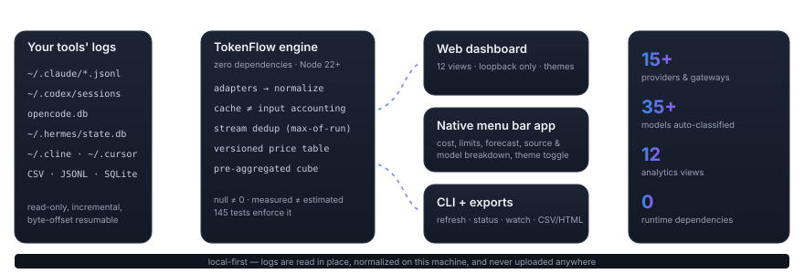
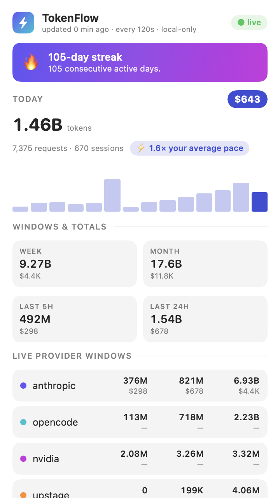

<h1 align="center">TokenFlow</h1>

<p align="center">
  <strong>See where your AI tokens actually go.</strong><br>
  Local-first analytics for tokens spent across Claude Code, Codex, OpenCode, Cline,
  Cursor, Hermes — or anything you can point it at.
</p>


<p align="center">
  
</p>

<p align="center">
  
  &nbsp;
  
</p>
<p align="center"><em>The native macOS menu bar popover — live cost, tokens, per-provider,
per-source and per-model usage, capacity meters and forecast, in light and dark.</em></p>

<p align="center">
  🌐 <a href="https://vimoxshah.github.io/tokenflow/"><strong>Landing page</strong></a>
  &nbsp;·&nbsp;
  🖥️ <a href="https://vimoxshah.github.io/tokenflow/demo/"><strong>Live demo</strong></a> <em>(synthetic data)</em>
  &nbsp;·&nbsp;
  📦 <a href="https://www.npmjs.com/package/@vimoxshah/tokenflow"><code>@vimoxshah/tokenflow</code> on npm</a>
  &nbsp;·&nbsp;
  🍺 <code>brew install --cask tokenflow</code> (via <a href="https://github.com/vimoxshah/tokenflow">this tap</a>)
</p>

**How deep it goes**

| Layer | What's inside |
|---|---|
| **Ingestion** | 11 adapters (Anthropic, OpenAI/Codex, OpenCode, Hermes, Cline, Cursor, Headroom gateway, git, OpenTelemetry/GenAI (otel), generic CSV/JSONL/SQLite import, demo). Incremental byte-offset resumes, re-read windows for upserted rows, budgeted refresh that stops cleanly mid-corpus |
| **Correctness** | Cache read/write/input kept as mutually exclusive buckets; vendor convention differences handled; streaming re-reports collapsed to max-of-run; `null` never coerced to 0; measured gateway cost kept separate from estimates |
| **Costing** | Versioned price table with per-entry source URLs and fetch dates; service-tier multipliers; long-TTL cache-write tier priced separately; unpriced models surface as `null` with a configure action — never silent `$0` |
| **Analytics** | 21 views: overview KPIs with a story strip, receipts per branch and pull request, cost per ticket, session anatomy, live, composition, provider/model intelligence, interfaces, hour×weekday heatmap + calendar, peaks, efficiency ratios, cache health, cost with coverage, model what-if, git correlations (labelled), rhythm and focus, period compare, compare branches, searchable data explorer, annotations, per-field data health |
| **Integrations** | A GitHub Action and a **self-hosted GitHub App** (your App, your server, our code) that put a receipt comment and a budget check run on every pull request; receipts as git notes that travel with the code; an **MCP server** so the agent can read its own bill; a **FOCUS-shaped export** for a FinOps tool; **org policy** pulled from a team server you run |
| **Live mode** | Watcher daemon, native Swift menu bar app (live sessions, today's receipts, guard state, provider/source/model breakdowns, capacity meters with reset countdowns & ETAs, forecast with stated confidence, MAD-based anomaly alerts, per-source sparklines, appearance toggle), SwiftBar/xbar plugin |
| **Engineering** | Zero runtime dependencies · 707 tests · lint invariants (e.g. "no `\|\| 0` on a token field") · tsc-clean JSDoc types · CI on macOS/Linux/Windows × Node 22/24 |

Zero runtime dependencies. Nothing leaves your machine. No API keys, no accounts, no telemetry.

## Uninstall

```bash
# macOS app
brew uninstall --cask tokenflow        # if installed via the tap
# otherwise: quit TokenFlow, drag /Applications/TokenFlow.app to Trash

# CLI / npm
npm uninstall -g @vimoxshah/tokenflow  # if installed globally

# data (everything local: config, records, digests, state)
rm -rf ~/.tokenflow

# optional extras you may have installed
launchctl unload ~/Library/LaunchAgents/app.tokenflow.digest.plist 2>/dev/null
rm -f ~/Library/LaunchAgents/app.tokenflow.digest.plist
launchctl unload ~/Library/LaunchAgents/app.tokenflow.bar.plist 2>/dev/null
rm -f ~/Library/LaunchAgents/app.tokenflow.bar.plist
```

Nothing is stored anywhere else. Deleting `~/.tokenflow` and the app removes every trace.

### Install

**Homebrew (macOS)** — the one-liner:

```bash
brew tap vimoxshah/tap https://github.com/vimoxshah/tokenflow
brew install --cask tokenflow
```

**npm (macOS, Linux, Windows)** — CLI + dashboard, no app bundle:

```bash
npx @vimoxshah/tokenflow@latest setup
```

**macOS app (manual)** — download `TokenFlow-*.dmg` from the
[**latest release**](https://github.com/vimoxshah/tokenflow/releases/latest) (each release also
carries `tokenflow-dashboard-demo.html`, an offline demo dashboard that opens in any browser).
Open the DMG, drag **TokenFlow.app** to Applications, launch from Launchpad.

> The build is unsigned (no Apple Developer account), so macOS blocks the first launch. This is
> expected and one-time only:
> 1. Open **System Settings → Privacy & Security** → scroll to **Security**.
> 2. Click **Open Anyway** next to the "TokenFlow was blocked" message.
> 3. Confirm **Open**.
>
> Alternatively right-click the app → **Open** → **Open**.

Then click the menu bar item → **Run setup**, which detects your installed tools and writes
`~/.tokenflow/config.yaml`. The watcher refreshes every two minutes after that.

**From source** (macOS, Linux, Windows — needs Node 22.5+, nothing else):

```bash
git clone https://github.com/vimoxshah/tokenflow.git && cd tokenflow
npm run setup        # detect Claude Code, Codex, OpenCode, Cursor, Cline…
npm start            # ingest what's new, then open the dashboard
```

No `npm run install` needed — zero dependencies. If nothing is detected, `node bin/tokenflow.js
providers` tells you what it looked for and where.

Just want a look first? `npm run demo` generates clearly-labelled synthetic data and opens the
dashboard.

---

## What it does

| Question | Where |
|---|---|
| What did this branch or pull request cost? | Receipts — spend per repository and branch, context share, copy as a PR comment |
| What did this ticket cost, across every branch that touched it? | Tickets: cost per Jira/Linear/GitHub key, from branch names and merged PR titles |
| How much AI did I use, and how has that changed? | Overview — the three insights that matter, then KPIs, daily series, trend |
| Input vs output vs cache? | Token composition — four buckets that sum to the total |
| Which provider and model do I rely on? | Provider & model share, growth, per-model efficiency |
| When do I use AI most? | Time patterns — hour/weekday profiles, heatmap, calendar |
| What does it cost? | Cost — estimated from a versioned price table with stated coverage |
| Does usage track shipped work? | Productivity — correlations with git activity, labelled as correlations |
| What changed between two periods? | Compare — any two windows, metric by metric |
| Can I trust these numbers? | Data health — per-field availability, per-adapter coverage |

<details>
<summary>All pages</summary>

Overview · Receipts · Tickets · Session anatomy · Live · Token composition · Providers & models ·
Interfaces · Time patterns · Peaks · Efficiency · Cache health · Cost · What-if · Productivity ·
Rhythm · Compare · Compare branches · Data explorer (searchable/sortable/exportable) ·
Annotations · Data health. Twenty-one in all, in a left sidebar grouped by topic (it collapses to
a rail, resizes by dragging, and becomes a drawer below 900 pixels).
Deep-link any of them: `#tab=receipts&skin=terminal&mode=light`.

Press ⌘K (or Ctrl+K) anywhere in the dashboard for the command palette: jump to a tab, change the
range, skin or mode, export, refresh or clear filters without touching the mouse. The first time
the live dashboard opens it explains what was found on this machine and what was not, and why.

</details>

*Every screenshot uses `npm run demo` data, which the UI labels as synthetic.*

## New in 1.3.0

- **Receipts on GitHub.** The receipt a push already attached as a git note becomes one pull
  request comment, and, with a cap you declare, a status check a branch protection rule can
  require before a merge. Runs as a GitHub Action.
  See [receipts-on-github.md](docs/receipts-on-github.md).
- **A self-hosted GitHub App.** The same comment and a "TokenFlow spend" check run, delivered by
  **your** GitHub App on **your** `tokenflow team serve`, with no CI job and no third party in the
  path. We host nothing: the receipt is read, posted back to the repository it came from, and
  dropped. See [github-app.md](docs/github-app.md).
- **Cost per ticket.** Branch receipts joined to the Jira, Linear or GitHub key in the branch name
  (or a merged PR's title): a Tickets tab and `tokenflow tickets`. Matching is a convention, so a
  branch that names no key stays unattributed rather than guessed. See [tickets.md](docs/tickets.md).
- **FOCUS export.** `tokenflow export --focus` and `tokenflow team --focus` write this machine's
  estimates onto the FinOps FOCUS column names, so they can sit beside a real cloud bill. Still an
  estimate at list price, never an invoice. See [focus-export.md](docs/focus-export.md).
- **An MCP server.** `tokenflow mcp` gives the agent four read-only tools: what this branch has
  cost, the caps in force here, recent totals, the monthly budget. The thing spending the money can
  finally see the bill. Local stdio, no network. See [mcp.md](docs/mcp.md).
- **Org policy.** A cap your team publishes on its own team server, cached locally and applied as a
  ceiling: it can lower an effective cap, never raise one. The guard hook reads the cache and never
  fetches, so a session is never blocked waiting on a server. See [policy.md](docs/policy.md).
- **A sidebar instead of a tab bar.** Twenty-one views no longer fit a tab strip. The dashboard is
  now an app shell: a left sidebar grouped by topic, collapsible to a rail, resizable, a drawer
  below 900 pixels.

## Supported sources

| Adapter | Source | Reports |
|---|---|---|
| `anthropic` | `~/.claude*/projects/**/*.jsonl` | per-request input, output, cache read/write, thinking |
| `openai` | `~/.codex/sessions/**/*.jsonl` | per-turn fresh/cached input, cache write, output, reasoning |
| `opencode` | opencode.db (XDG data dir) | per-request fresh input, cache read/write, output |
| `hermes` | `~/.hermes/state.db` | per-session-per-model tokens, measured cost when recorded |
| `cline` | `~/.cline/data/sessions/**` | sessions + model only — this source has no token counts |
| `cursor` | cursor ai-code-tracking db | AI-authored edits per commit |
| `headroom` | `~/.headroom/savings_events.jsonl` | measured cost + compression delta from a local gateway (overlay) |
| `git` | any repository | commits, churn — independent work signal |
| `generic` | CSV / TSV / JSON / JSONL / SQLite | anything via a saved field mapping |
| `mock` | — | deterministic demo data, always labelled |

New adapters drop into `src/providers/<id>/index.js` or `$TOKENFLOW_HOME/providers/*.js`; new
providers and models appear in every chart automatically. See [docs/providers.md](docs/providers.md).

## Correctness guarantees

The parts most token dashboards get wrong:

- **Cache tokens are not input tokens.** Fresh input, `cache_read`, `cache_write` and output are
  mutually exclusive and sum to the total; long-TTL refreshes and reasoning are subsets, never
  added again.
- **Vendors disagree on `input_tokens`.** Anthropic excludes cache; OpenAI includes cached input.
  The OpenAI adapter subtracts so nothing counts twice.
- **Streaming logs re-report usage.** Summing them inflates totals badly (on our test corpus, ~45x
  for Codex). Adapters take the maximum of each monotonic run instead.
- **Missing ≠ zero.** Unknown token fields are `null`, never coerced to `0`; sums skip nulls and
  report coverage.
- **Overlay measurements don't inflate totals.** Gateway/proxy records describe traffic another
  adapter already counted; they're excluded by default and used only for measured-cost cross-checks.
- **No invented prices.** Unpriced models show `null` cost and are listed for configuration — never
  silently `$0`.

## Refresh model

Transcripts are append-only, so the store tracks each file's `{size, mtime, offset}`: unchanged
files are skipped entirely, grown files resume at their byte offset, rewrites are superseded and
compacted. On a real 1.5 GB / 5,110-file corpus: ~15 s first ingest, ~2 s no-op refresh.
`refresh --budget 30` stops cleanly on a file boundary and resumes later — big ingests fit inside
CI steps or browser requests.

## CLI

```bash
node bin/tokenflow.js setup          # detect tools, write ~/.tokenflow/config.yaml
node bin/tokenflow.js refresh        # incremental ingest (--full re-reads everything)
node bin/tokenflow.js status         # current numbers, same modules the dashboard calls
node bin/tokenflow.js providers      # what was detected, where
node bin/tokenflow.js dashboard      # live UI at http://127.0.0.1:7799 (loopback only)
node bin/tokenflow.js watch          # auto-refresh every N seconds (default 120)
node bin/tokenflow.js import f.csv   # CSV/JSONL/SQLite via saved field mapping
node bin/tokenflow.js export --csv   # --all for everything; --html for offline snapshot
node bin/tokenflow.js digest         # shareable weekly digest (--format text, --from/--to, --out f.md)
node bin/tokenflow.js week           # this week's spend vs last week (--svg/--png card, --json)
node bin/tokenflow.js models-compare # cost/usage efficiency per model — your data
node bin/tokenflow.js budget --set 200   # monthly cap + forecast alerts (fires once per state/month)
node bin/tokenflow.js schedule --install --at "Monday 09:00"  # weekly digest via launchd
node bin/tokenflow.js diagnostics    # local observability — nothing transmitted
node bin/tokenflow.js team           # per-developer team view (needs sync + opt-in names)
node bin/tokenflow.js team serve     # self-hosted team server (LAN/Docker), no shared folder needed
node bin/tokenflow.js team check     # is that server reachable, and is this token accepted?
node bin/tokenflow.js sync --to <url> --token <t>   # push this machine's rollups to a team server
node bin/tokenflow.js receipt --repo . --gh   # what each branch / merged PR cost (sees through worktrees)
node bin/tokenflow.js receipt --sessions      # where the money goes: concentration, context vs work, marginal cost/turn
node bin/tokenflow.js receipt --csv           # one row per branch, every repository
node bin/tokenflow.js hooks install           # pre-push git hook: attach a receipt note, never blocks
node bin/tokenflow.js guard --install         # Claude Code hook: warn/block a session against caps you declare
node bin/tokenflow.js guard --install --codex # same circuit breaker for Codex CLI (warns only)
node bin/tokenflow.js tickets        # cost per ticket key, from branch names and merged PR titles
node bin/tokenflow.js policy show    # the caps in force here: personal, then repo, then org ceiling
node bin/tokenflow.js export --focus # FOCUS-shaped CSV for a FinOps tool that already reads it
node bin/tokenflow.js mcp            # MCP server on stdio, so the agent can read its own bill
node bin/tokenflow.js pricing diff table.json --apply   # merge a candidate price table in
node bin/tokenflow.js doctor         # environment, store, adapters, and a data-quality audit
node bin/tokenflow.js up             # refresh → rebuild offline HTML → serve + open

npm link                             # optional: global `tokenflow` command
```

Every command is documented in [docs/cli.md](docs/cli.md); every config field in
[docs/configuration.md](docs/configuration.md).

## Menu bar app (macOS)

```bash
node bin/tokenflow.js menubar --app   # builds & launches the native app
```

A small native Swift app compiled on your machine (no Electron): status item shows spend today or
limit pressure (`▲ 82%`, `✗ 105%`), with a dropdown covering today/week/month, per-provider rows,
per-source and per-model usage, capacity meters with reset countdowns, forecast, anomaly alerts,
and an appearance toggle (system → light → dark, persisted)
([light](docs/media/menubar-light.png) / [dark](docs/media/menubar-dark.png)). Declare caps yourself:

```yaml
limits:
  - id: anthropic-monthly
    provider: anthropic
    scope: month
    metric: tokens            # or cost / requests / input / output
    cap: 120000000
```

Quotas exist because you declared them — none are invented. Details:
[docs/live-mode.md](docs/live-mode.md). SwiftBar users: `menubar --swiftbar --out <dir>`.

## Themes & export

Three skins (Aurora default, Terminal, Editorial) × dark/light, persisted via `ui.skin` /
`ui.mode`. Series colours belong to the mode, not the skin, validated for colour-blind separation —
switching themes never changes what a colour means.

`export --html` produces one self-contained offline file (CSS + analytics + data inline) that opens
from `file://` with no server. A full CSV export doubles as a portable dataset:
`tokenflow restore <file>.csv --yes` rebuilds a store on another machine without the raw vendor logs.

## Contributing

```bash
npm test               # 707 tests: normalization, adapters, analytics, store, receipts, guard
npm run lint           # project invariants (incl. "no || 0 on a token field")
npm run typecheck      # tsc over JSDoc types — must be zero errors
npm run validate       # self-check: runtime, adapters, store↔cube agreement
```

Read [CONTRIBUTING.md](CONTRIBUTING.md) first — it states the five invariants that keep this honest
(missing is not zero; measured and estimated never mix; a streamed usage block is a snapshot;
tokens are not productivity; nothing leaves the machine).

Easiest contribution: an adapter (`src/providers/<id>/index.js`) plus a fixture under
`test/fixtures/`, stating in its header comment what each vendor field means.

## Documentation

- [getting-started.md](docs/getting-started.md) — install to first dashboard
- [live-mode.md](docs/live-mode.md) — watcher, menu bar, capacity, forecasts
- [configuration.md](docs/configuration.md) — every config field
- [providers.md](docs/providers.md) — every adapter, what it reads
- [data-model.md](docs/data-model.md) — schema and token accounting rules
- [creating-provider.md](docs/creating-provider.md) — the adapter contract
- [cli.md](docs/cli.md) — every command and flag
- [receipts-on-github.md](docs/receipts-on-github.md): the Action, the budget gate, the merge gate
- [github-app.md](docs/github-app.md): run your own GitHub App on your own server
- [tickets.md](docs/tickets.md): cost per ticket, and what the matching can and cannot do
- [policy.md](docs/policy.md): the org policy ceiling above the personal and repo caps
- [mcp.md](docs/mcp.md): the MCP server, and what the agent can ask it
- [focus-export.md](docs/focus-export.md): the FOCUS column mapping, and its honest caveats
- [receipt-schema.md](docs/receipt-schema.md): the portable receipt, v0 and v1
- [architecture.md](docs/architecture.md) — layers and plugin points
- [troubleshooting.md](docs/troubleshooting.md) — when the numbers look wrong

## Privacy & security

Local data → local normalization → local analytics → local dashboard. The dashboard binds to
`127.0.0.1`. No prompt text, code, or file content is ever stored — adapters read token counts and
discard the rest. No telemetry, no pricing service, no update check.

Every network path there is, in full. Each one is off until you turn it on, and each one goes to
an address you chose.

**Outbound, only when you opt in:**

- **Multi-machine sync** (`sync:` in config) exchanges daily totals (date, tokens, requests,
  est. cost) through a folder you own (iCloud/Dropbox/Syncthing). Never prompts, code or
  credentials. Default is OFF; nothing leaves this machine until you set `sync.enabled: true`.
- **Team server push** (`sync.to` in config, or `tokenflow sync --to <url>`) sends those same two
  sync files to a server you run with `tokenflow team serve`, behind a bearer token. Nothing else.
- **Receipt notes** (`tokenflow hooks install`) push `refs/notes/tokenflow` to **your own** git
  remote, alongside the branch you were already pushing. The receipt holds counts and dollars, and
  no prompt or code content.
- **Org policy pull** (`tokenflow policy pull`, and the cache refresh `tokenflow refresh` runs)
  reads `GET <sync.to>/api/policy` from your team server. It only reads; it sends no usage.
- **Team check** (`tokenflow team check`) asks that same server whether it is healthy.
- **Digest delivery** (`delivery:` in config) sends the digest you generate to your own Telegram
  chat, email, or webhook. Credentials live only in `~/.tokenflow/config.yaml`.
- **Map location** (`map.showMyLocation: true`) is one cached IP geolocation of this machine, to
  place "you" on the Global activity map. The IP itself is never stored.

**Inbound, only on a server you run:** `tokenflow team serve` receives the rollups your machines
push, and, when you configure your own GitHub App on it, deliveries at `POST /github/webhook`
verified by GitHub's signature over the raw body. There is no hosted TokenFlow service to receive
anything: that process is yours, on your machine, and it keeps no copy of a receipt it posts back.

**Neither:** `tokenflow mcp` is local stdio, with no socket and no network call. Building a ticket
URL is string work and never contacts your tracker. `tokenflow receipt --gh` shells out to the
GitHub CLI you already authenticated.

Two more privacy defaults worth knowing:

- **Team view** (`tokenflow team`) shows per-developer usage from the shared folder. A name appears
  next to a machine only if its owner set `sync.developerName` themselves; machines without it stay
  anonymous and are excluded from per-person rows.
- **Prompt analytics** (`promptAnalytics:` in config) is OFF by default; even when enabled, only
  one-way prompt hashes and keyword categories are stored. Raw text requires a separate opt-in.

Everything lives in `~/.tokenflow/`.
[SECURITY.md](SECURITY.md) covers the threat model and private vulnerability reporting.

## License

MIT — see [LICENSE](LICENSE).
